------------------------------
## 📘 Project 1 Summary: Network Isolation & Secure Triage

| Feature | Technical Core Concept |
|---|---|
| Main Objective | To implement Micro-segmentation and a Bastion/Jumpbox architecture to protect high-value assets (the DB) from the Public Web. |
| Core Concept: NSG | Stateful Packet Inspection (SPI). In CCNA, you learned ACLs. In Azure, NSGs are "Stateful"—they remember the connection. If you allow traffic in, the return traffic is automatically allowed out. |
| Core Concept: Pivoting | Tunneling / Administrative Proxy. Instead of exposing every server to the internet, you use a single "Hardened" point (the Web VM) to jump into the private zone. This mimics a VPN or a Proxy. |
| Network Topology | Hub-and-Spoke (Simplified). You are learning how to route traffic between different subnets while enforcing "Least Privilege" at the network layer. |

------------------------------
## 🛡️ Why This Project Matters (The "Why")

   1. Attack Surface Reduction: By removing the Public IP from the Database VM, you effectively make it "invisible" to 99% of automated internet scans and brute-force attacks.
   2. Traffic Control: It forces all administrative traffic through a single, monitorable path. In a real company, we would put an IPS (Intrusion Prevention System) on the Web VM to watch every move an admin makes.
   3. Blast Radius Limitation: If a hacker compromises your Web Server (Port 80), they still cannot get to your Database easily because the NSG acts as an internal wall between the subnets.

------------------------------
## 🚀 The Study Tip (CCNA vs. Cloud)

* Subnetting: In CCNA, subnets are about saving IP addresses. In the Cloud, subnets are about Security Boundaries. You put the DB in a different subnet not to save IPs, but so you can put a Wall (NSG) between it and the Web.
* Default Gateway: In CCNA, you configure this manually. In Azure, it’s a System Route (0.0.0.0/0 via Virtual Network). This is why your "Exfiltration Test" (pinging Google) worked—Azure handles the routing for you automatically.

------------------------------

## 🛡️ Level 1 Project: The Ghost Database
Phase 1: Detailed Infrastructure Execution

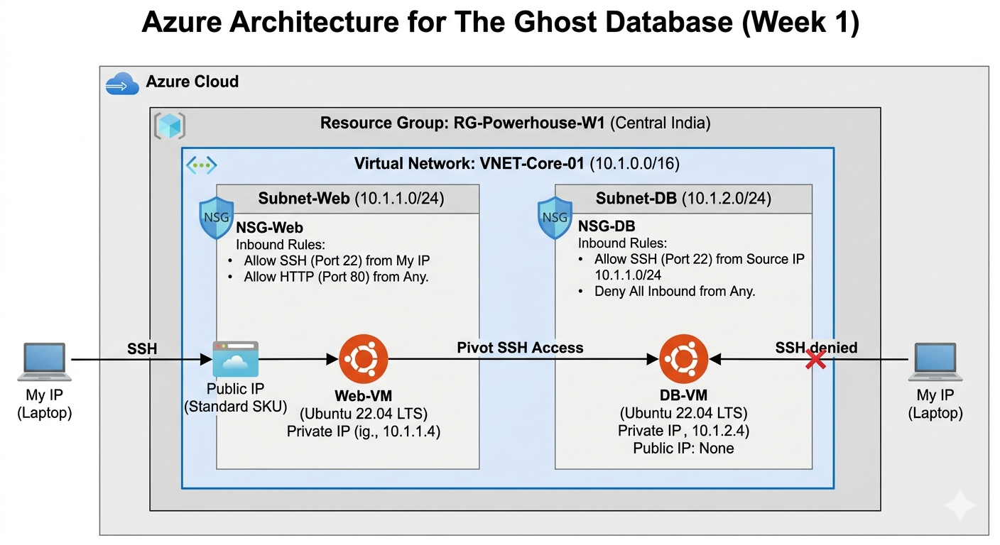

## 1. Resource Group (The Container)

* Search for "Resource Groups" in the top bar.
* Click `+ Create`.
* Project Details:
* Subscription: Select your Free Trial.
   * Resource Group: `RG-Powerhouse-W1`
   * Region: `Central India` (or your closest region).
* Click `Review + create -> Create`.

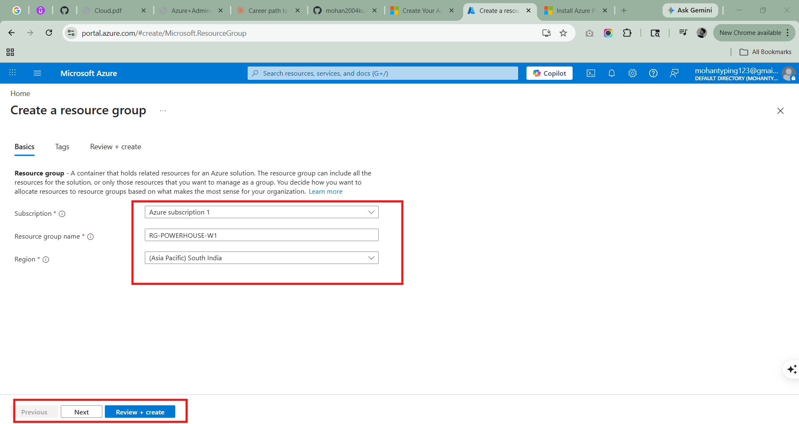

## 2. Networking (The Virtual Wires)

* Search for "Virtual Networks".
* Click `+ Create`.
* Basics Tab:
* Name: `VNET-Core-01`

   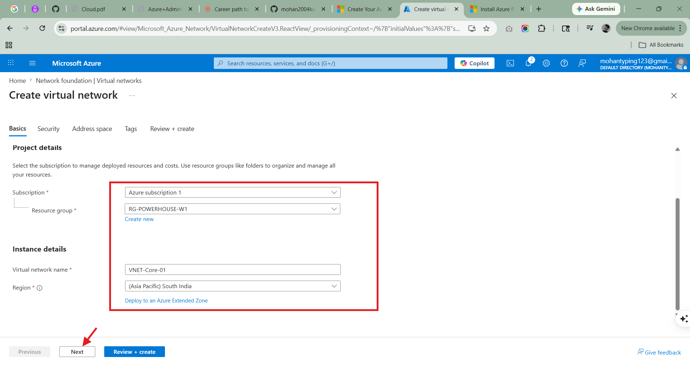

* IP Addresses Tab:
* IPv4 Address Space: Delete the default and type `10.1.0.0/16`.
   * Subnets: Click `+ Add subnet`.
   * Name: Subnet-Web | Range: `10.1.1.0/24` -> Click `Add`.

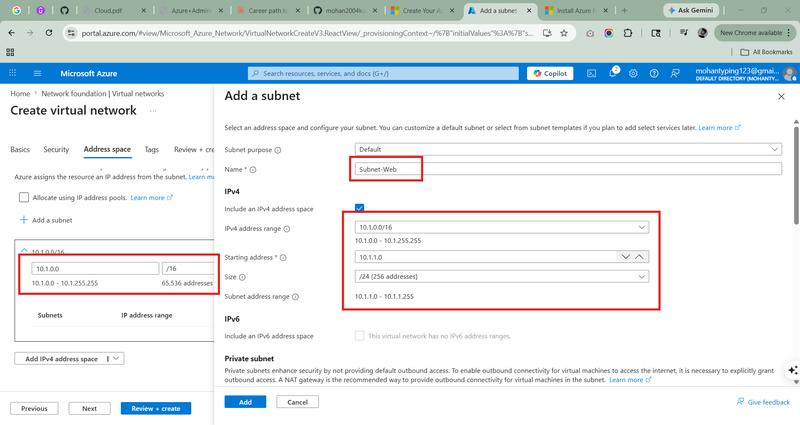

      * Name: `Subnet-DB` | Range: `10.1.2.0/24` -> Click `Add`.
   * Click `Review + create -> Create`.

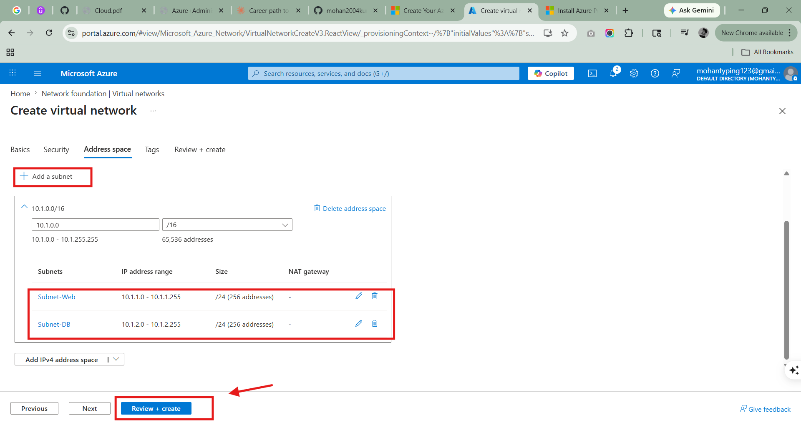

## 3. Network Security Groups (The Firewalls)

* Search for "Network security groups".
* Click `+ Create`.
* Create TWO: `NSG-Web` and `NSG-DB` in the same Resource Group.

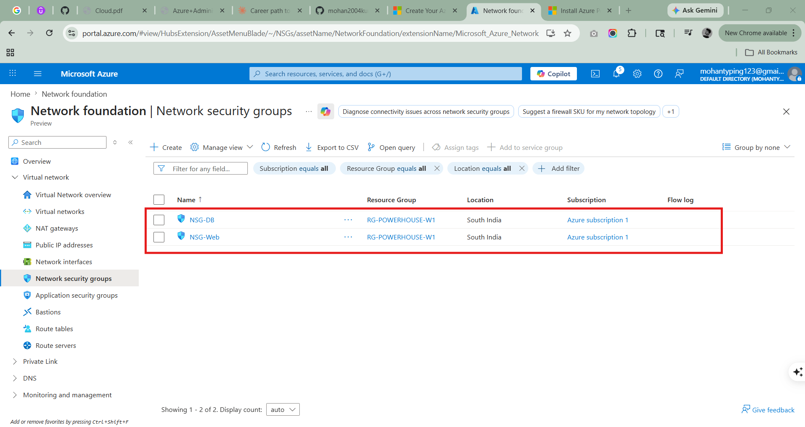

* Configure NSG-Web:
* Go to Inbound security rules -> Click `+ Add`.
   * Rule 1: Source: `IP Addresses` | Source IP: **Your Local Laptop IP** | Port: `22` | Action: `Allow` | Priority: `100` | Name: `AllowSSH-Home`.

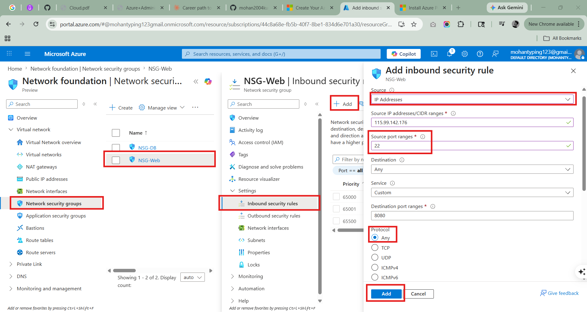

   * Rule 2: Source: `Any` | Port: `80` | Action: `Allow` | Priority: `110` | Name: `AllowHTTP-All`.

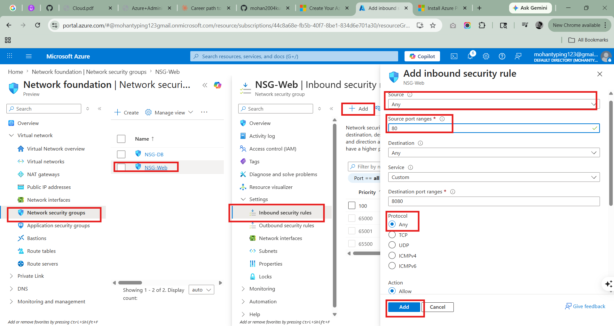

* Configure NSG-DB:
* Go to Inbound security rules -> Click `+ Add`.
   * Rule 1: Source: `IP Addresses` | Source IP: `10.1.1.0/24` | Port: `22` | Action: `Allow` | Priority: `100` | Name: `AllowSSH-From-WebTier`.

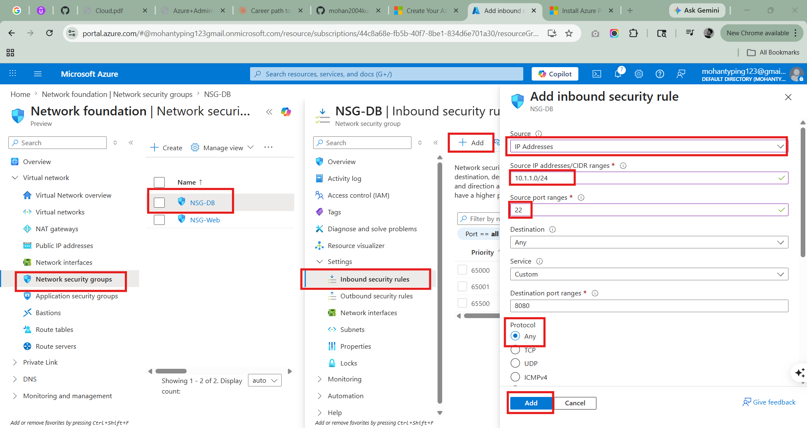

   * Rule 2: Source: `Any` | Port: `Any` | Action: `Deny` | Priority: `4096` | Name: `Explicit-Deny-All`.

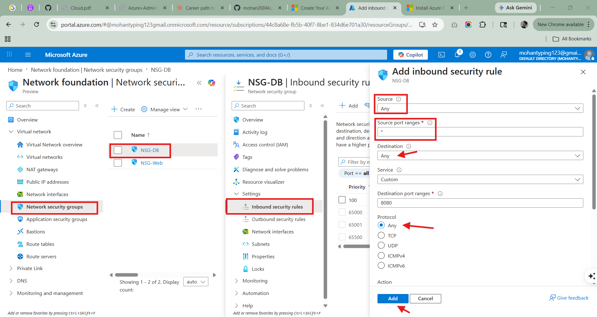

* ASSOCIATE: Inside each NSG, click Subnets (on the left menu) -> Click `Associate` -> Select `VNET-Core-01` and the correct Subnet.

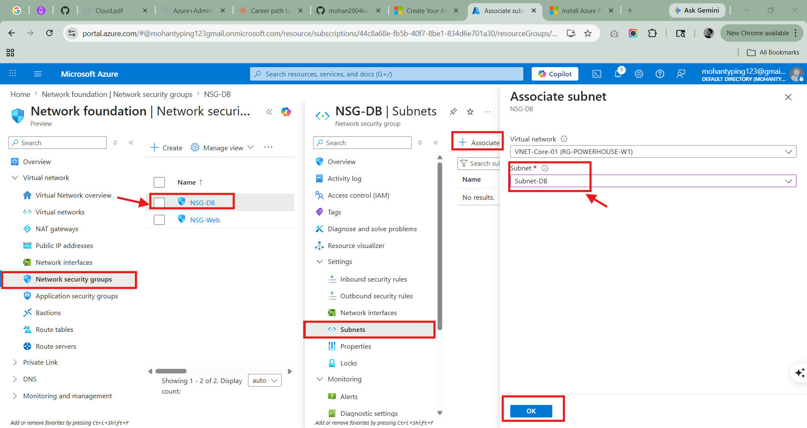

## 4. Compute (The Targets)

* Search for "Virtual Machines" -> Click `+ Create -> Azure Virtual Machine.`
* Web-VM Deployment:
* Name: `VM-Web-Prod`
   * Image: `Ubuntu Server 22.04 LTS - x64 Gen2`
   * Size: `Standard_B1s` (Keep it cheap!).
   * Authentication: `SSH Public Key`.
   * Key Pair Name: `Powerhouse-Key`. (Download the `.pem` file when prompted!)
   * Networking Tab: Select `Subnet-Web`. Public IP: `(new) VM-Web-IP`. NIC Network Security Group: Select `None` (Since we already associated the NSG to the Subnet).

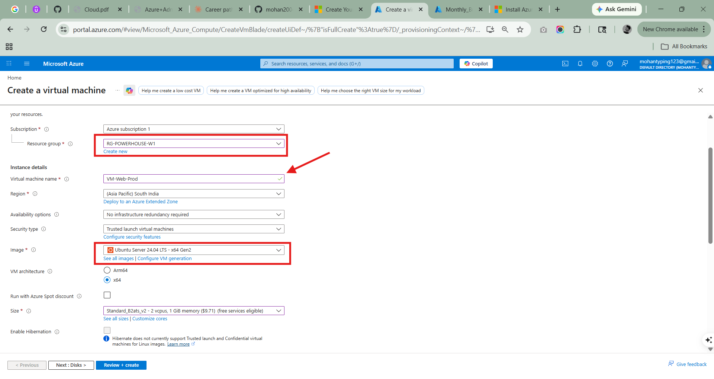

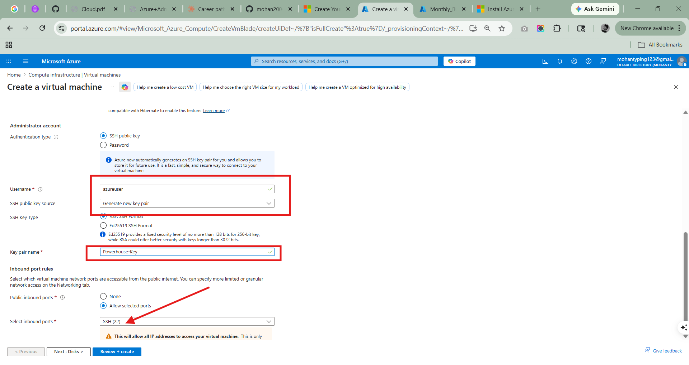

* DB-VM Deployment:
* Name: `VM-DB-Prod`
   * Networking Tab: `Select Subnet-DB`. Public IP: `None`.

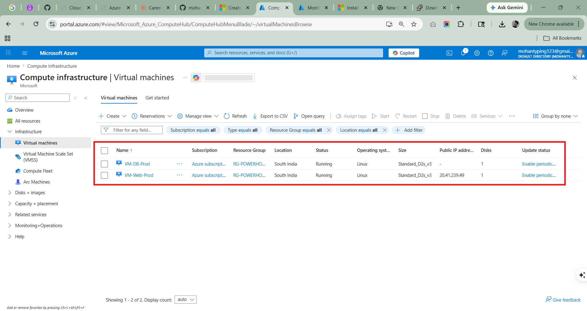

------------------------------
## ⚔️ Phase 2: The Attack (Verification Steps)## Test 1: The Direct Hit

   1. Open your laptop terminal (CMD or PowerShell).
   2. Type: `ssh -i Powerhouse-Key.pem azureuser@<DB-VM-Private-IP>`
   3. Result: It will hang forever. Victory. The firewall is working.

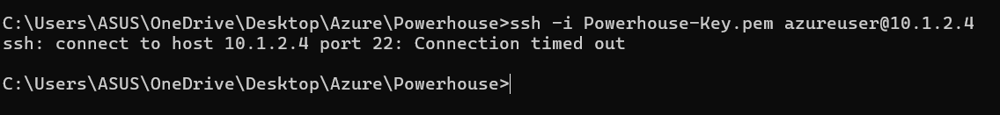

## Test 2: The Pivot (The Engineer's Way)

   1. On your laptop, add your key to the agent:
   * `ssh-add Powerhouse-Key.pem`
   2. Connect to the Web-VM with Agent Forwarding:
   * `ssh -A azureuser@<Web-VM-Public-IP>`

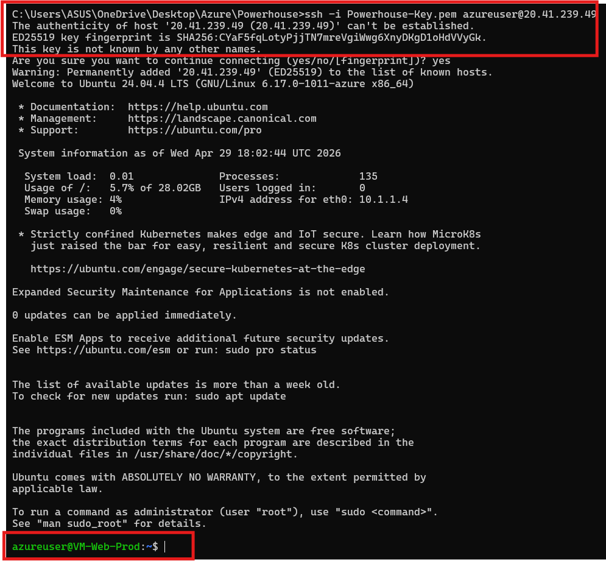

   3. Once inside the Web-VM, jump to the DB:
   * `ssh azureuser@10.1.2.4`

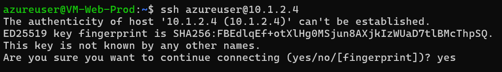

   4. Result: You are in. You have successfully "pivoted" through your secure tier.

## Summary Checklist :

* The "What": I built a two-tier network.
* The "How": I used VNETs and NSGs to isolate the tiers.
* The "Why": To prevent direct public access to sensitive data and enforce a secure management path (Pivoting).

------------------------------
