------------------------------
## 📘 Project 2 Summary: Identity & Private Connectivity

| Feature | Technical Core Concept |
|---|---|
| Main Objective | To shift from Network-based security (Firewalls) to Identity-based security (Zero Trust) and Private Data Transit. |
| Core Concept: RBAC | Role-Based Access Control. In CCNA, you have "Enable" passwords. In Azure, you have specific "Roles" (Contributor, Reader, Owner). We are proving that who you are is more important than what password you have. |
| Core Concept: Private Link | Tunneling/VLAN-like Isolation. Instead of a public URL, we give the Storage Account a Private IP inside your VNET. It effectively becomes a "Local Disk" on your internal network. |
| The "Key" Shift | Stateless vs. Identity. Access Keys are like a physical key to a house—if you lose it, anyone can enter. RBAC is like a Biometric Scanner—it only lets you in, and we can log every time you touch the door. |

------------------------------
## 🛡️ Why This Project Matters (The "Why")

   1. Eliminating the "Public Surface": By disabling public access, you are making your data invisible to every hacker on the internet. Even if they have your username and password, they can't even "see" the storage account to try and log in.
   2. DNS Poisoning Prevention: By using Private DNS Zones, you ensure that your internal traffic stays within the Microsoft Global Network. It never touches the "Dirty Internet."
   3. Governance: In AZ-104, you learn that companies lose data because of "Leaky Buckets" (Public Storage). This project teaches you the Standard Operating Procedure (SOP) to prevent that leak.

------------------------------
## 🚀 The "Powerhouse" Study Tip
As you build this weekend, keep this CCNA-to-Azure mapping in your head:

* Access Keys = Telnet/Enable Password (Old, insecure).
* RBAC (Identity) = TACACS+/RADIUS (Modern, centralized, secure).
* Private Endpoint = A Virtual Lease Line / Internal VLAN.

------------------------------
## Phase 1: The Networking Backbone (The Foundation)
Before the vault is built, we need the "ground" to put it on.

   1. Create the Resource Group:
   * Search for Resource Groups -> Click + Create.
      * Name: RG-Powerhouse-W2.
      * Region: Central India (or your preferred region).
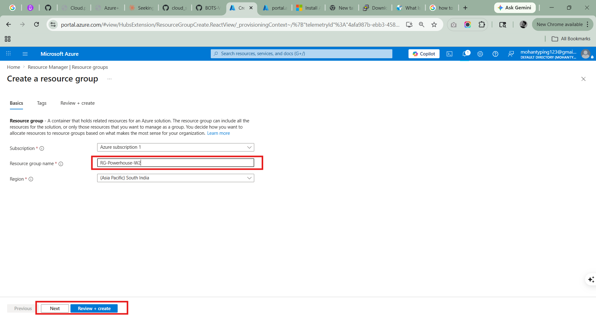
   2. Create the Virtual Network (VNET):
   * Search for Virtual Networks -> Click + Create.
      * Name: VNET-Core-01.
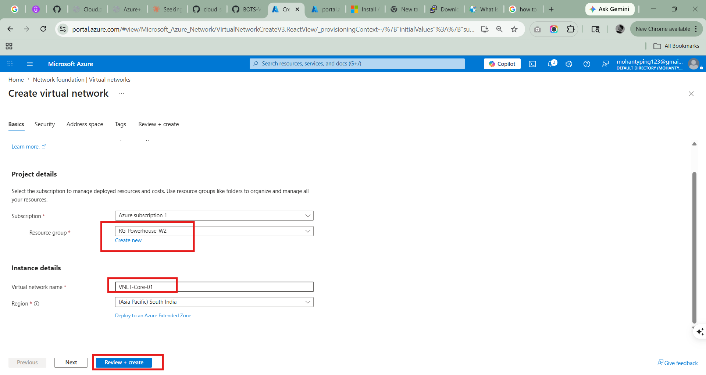
      * IP Addresses Tab:
      * Change the address space to 10.1.0.0/16.
         * Click + Add subnet. Name it Subnet-DB with range 10.1.2.0/24.
      * Click Review + Create -> Create.
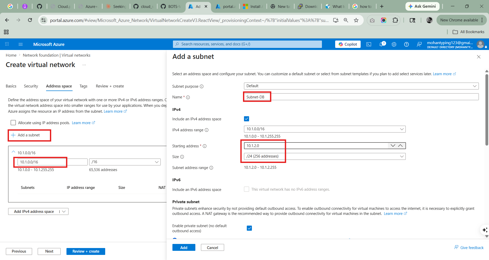
   
------------------------------
## Phase 2: The Storage Vault (The Resource)
We are creating the data container and hiding it from the public internet.

   1. Create the Storage Account:
   * Search for Storage Accounts -> Click + Create.
      * Basics Tab:
      * Storage account name: stpowerhousevault[yourname] (Needs to be unique globally).
         * Performance: Standard.
         * Redundancy: Locally-redundant storage (LRS).
      * Networking Tab (CRITICAL STEP):
      * Network access: Select "Disable public access and use private endpoints".
      * Click Review + Create -> Create.
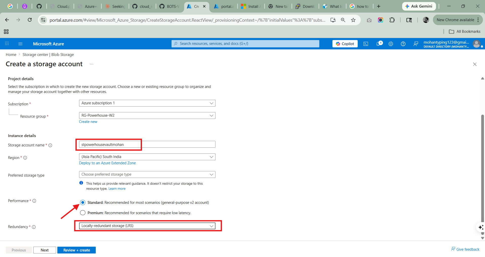   

------------------------------
## Phase 3: The Private Tunnel (The Connectivity)
This connects your VNET directly to the hidden Storage Account.

   1. Go to your new Storage Account once it is finished.
   2. On the left menu, scroll down to Networking.
   3. Click the Private endpoint connections tab at the top.
   4. Click + Private endpoint.

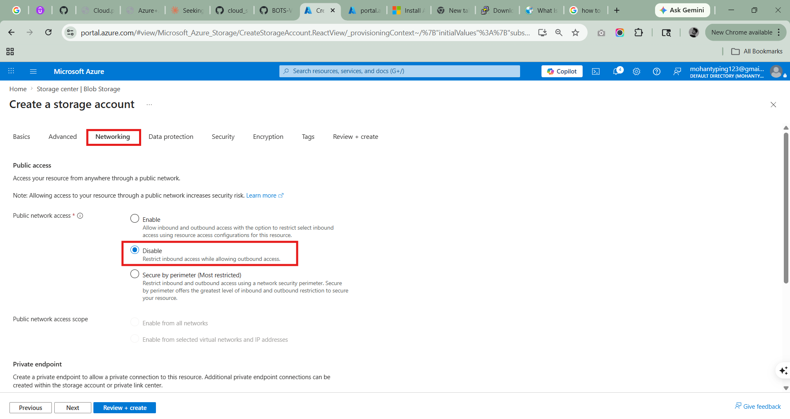   

   5. Basics Tab: Name it pe-vault-link.
   6. Resource Tab: Ensure "Target sub-resource" is set to blob.
   7. Virtual Network Tab:
   * Virtual Network: VNET-Core-01.
      * Subnet: Subnet-DB.
   8. Configuration Tab (The DNS Step):
   * Integrate with private DNS zone: Yes.
      * (This ensures that when you type the storage name, it goes to the private IP 10.1.2.x and not the internet).
   9. Click Review + Create -> Create.

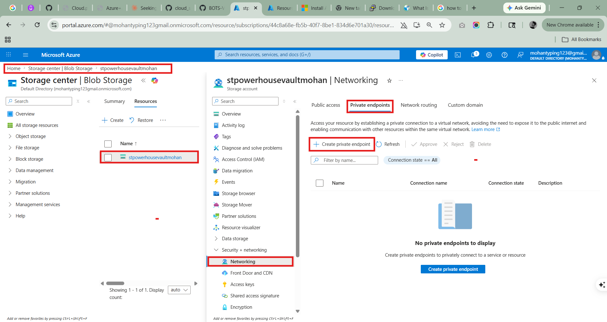   

------------------------------
## Phase 4: The Identity Lock (The Security)
Now we tell Azure: "Only MY fingerprint opens this vault."

   1. Role Assignment (The Permission):
   * In the Storage Account, click Access Control (IAM) on the left.
      * Click + Add -> Add role assignment.

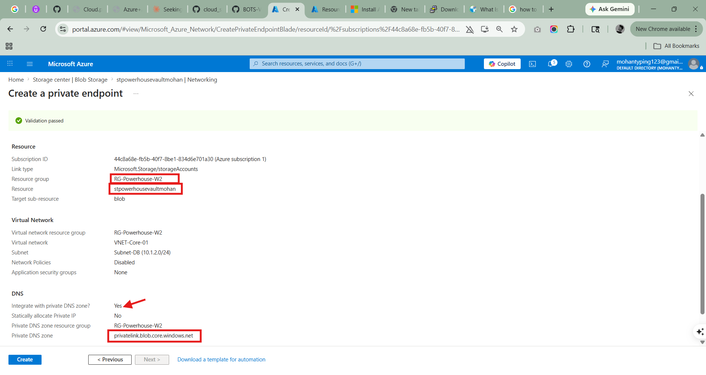   

      * Search for the role: Storage Blob Data Contributor. (This is the specific "Key" for data).

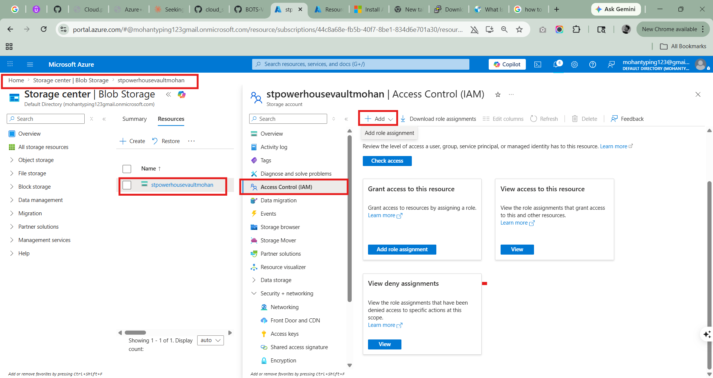   

      * Assign access to: User, group, or service principal.
      * Click + Select members and find your own email/account.
      * Click Review + assign.

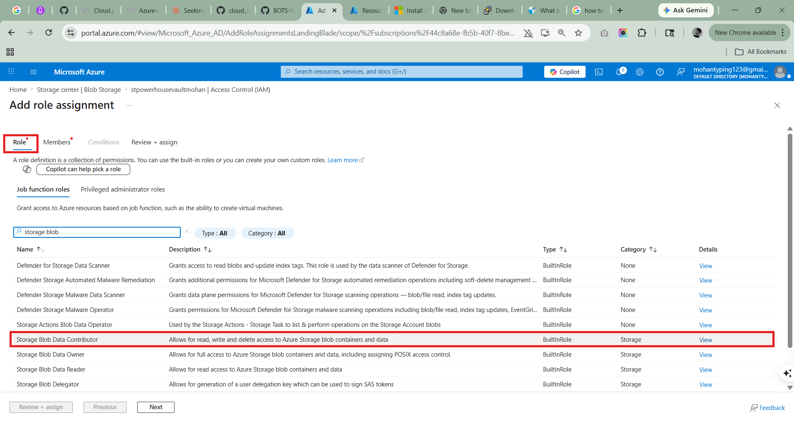   

   2. Disabling the "Backdoor" (The Final Lockdown):
   * In the Storage Account, click Configuration (under Settings).
      * Find Allow storage account key access -> Set it to Disabled.
      * Click Save.
      * Now the physical "Keys" are dead. Only your "Identity" (Fingerprint) works.

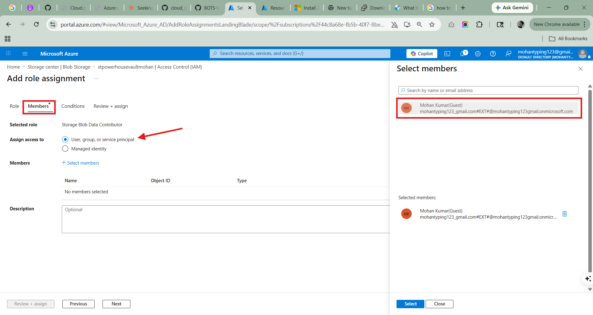   

------------------------------
## Phase 5: The "Powerhouse" Validation (The Proof)

   1. Upload a File:
   * In the Storage Account, go to Containers -> + Container. Name it secret-data.

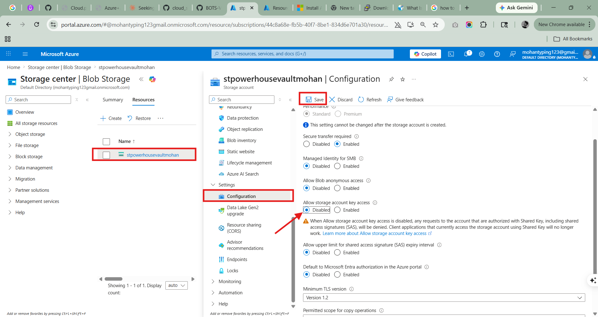   

      * Upload any image or text file from your computer.

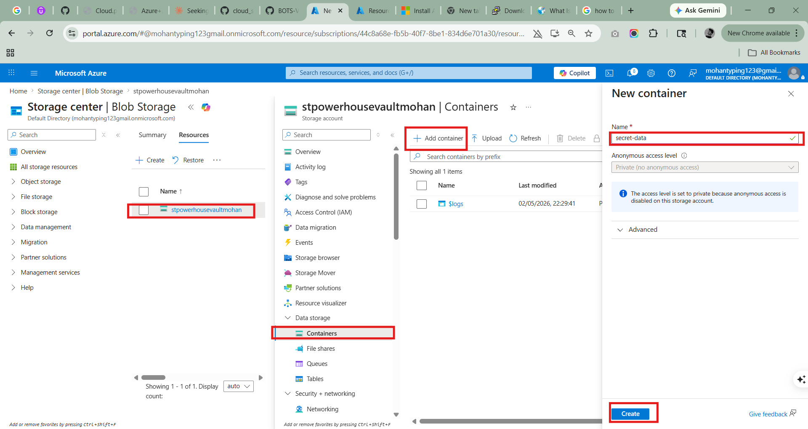   

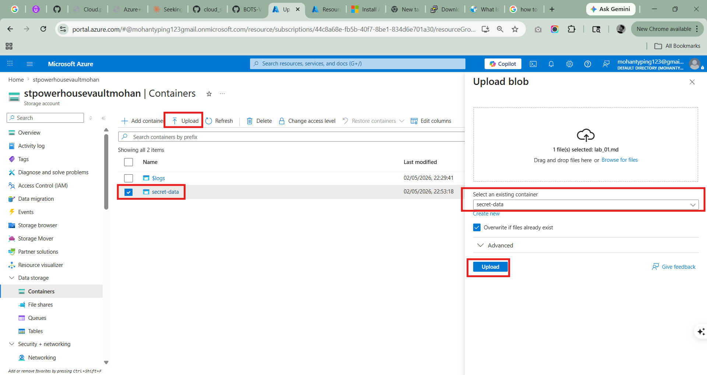   

   2. Test 1 (The Internet Block):
   * Copy the URL of that uploaded file.

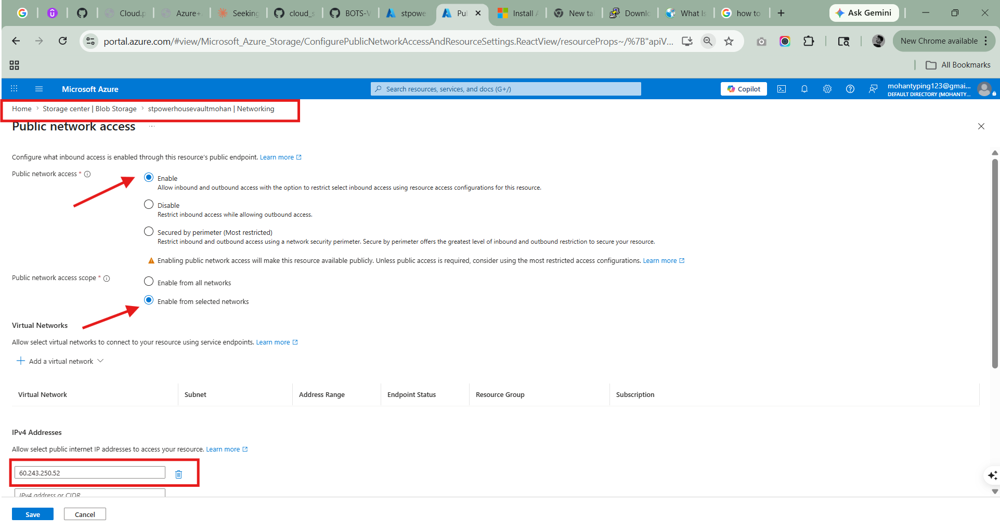   

      * Open an Incognito Browser on your laptop and paste the URL.
      * Expected Result: You should get a 403 Forbidden error. (This proves the internet is blocked).

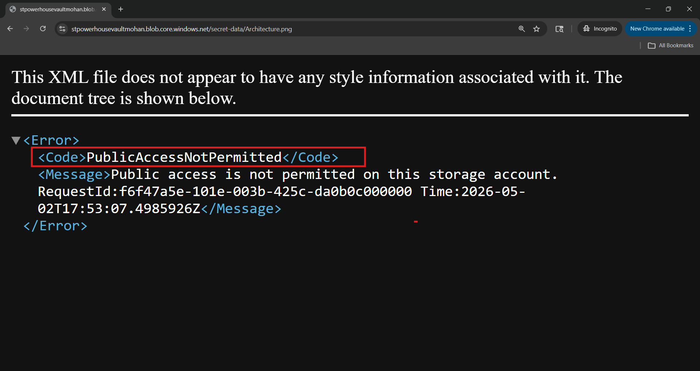   

   3. Test 2 (The Identity Access):
   * Inside the Azure Portal (where you are logged in), go to Storage Browser -> Blob containers -> secret-data.
      * Expected Result: You can see and download the file. (This proves your Identity works).
   
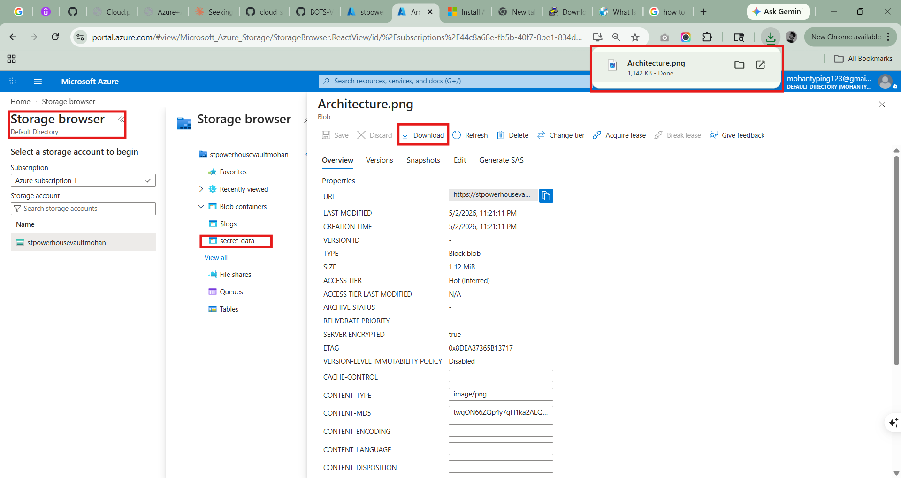   
